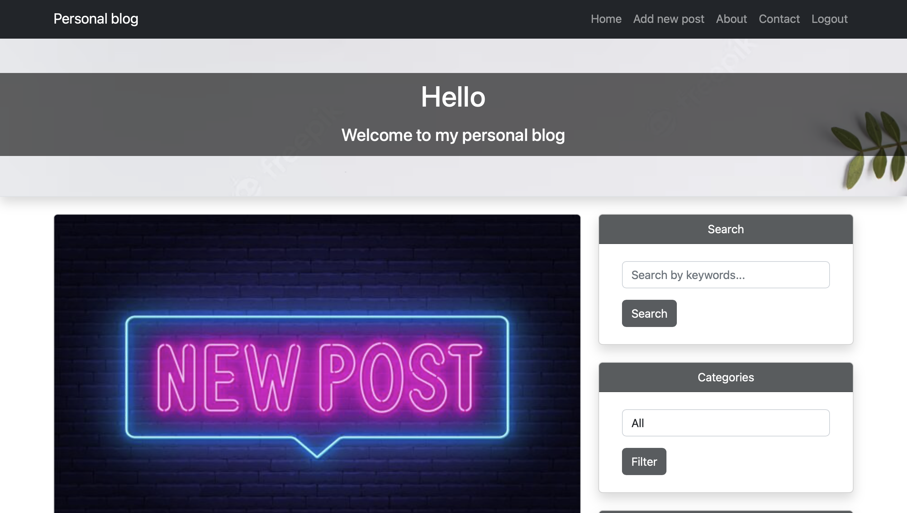

# Personal Blog

Personal Blog is a web application developed using Django.\
This is a platform for publishing personal articles, where each user can create an account and write a comment.


## Installation

Follow these steps to install and run the project:

1. Clone the repository:\
` git clone https://github.com/ArtMot99/personal-blog.git `
2. Change to the project directory:\
` cd personal-blog `
3. Install and activate the virtual environment:\
` python3 -m venv venv & source venv/bin/activate `
4. Install dependencies:\
` pip install -r requirements.txt `
5. Make migrations:\
` python manage.py migrate `


## Project setup:

Before starting the project, you will need to create an .env file to store your environment variables.\
Create an .env file in your project root directory and fill it like this:

```
DJANGO_SECRET_KEY=your-secret-key
DEBUG=1
ALLOWED_HOSTS=localhost,127.0.0.1
```

Please replace **your-secret-key** with your Django secret key.


## Start

Run the following command to start the project:

` python manage.py runserver  `


## Contacts

If you have any questions please contact me via email: **motrunich2013@gmail.com**\
Repository: https://github.com/ArtMot99/personal-blog/


## Features

* User registration and authorization system available.
* The user can leave a comment on the post and can also delete the comment.
* Three widgets are available on the main page for filtering posts by category, searching for posts by keywords,\
as well as a widget with popular posts, the popularity of posts depends on the number of comments.
* Added pagination for both the main page with posts and comments.
* The about page is available with a short description and a link to GitHub.
* There is a contact page where you can leave your feedback.
* For the administrator, a link to create a post has been added to the navigation menu, as well as buttons for editing\
and deleting a post on the page with a post.
* You can add an image to each post, otherwise the image will be added by default.
* Added CKEditor for convenience when creating & updating a post.


## Demo


